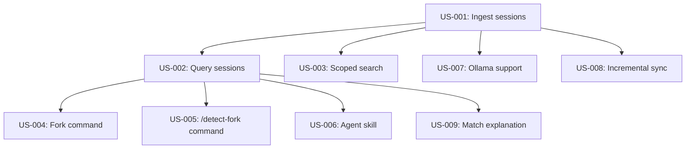

# Product Requirements Document: Smart Fork

**Project:** Smart Fork - Semantic Session Discovery  
**Author:** David Helmus  
**Created:** 2025-01-21  
**Status:** Draft  
**Version:** 0.2

---

## 1. Context

Every OpenCode session accumulates valuable context: codebase understanding, solved problems, architectural decisions, debugging journeys, and domain knowledge. When a session ends, this context becomes trapped in transcript files at `~/.local/share/opencode/sessions/`—searchable only by filename or basic text grep.

**The cost of lost context:**
- Re-explanation overhead: 3-5 messages re-teaching Claude about the codebase per session
- Repeated mistakes: Solutions discovered in past sessions are forgotten
- Missed connections: Related work across projects never cross-pollinates
- Cognitive load: Manually searching hundreds of transcripts to find "that session where we did X"

OpenCode's `--session <id>` flag allows resuming sessions, but requires knowing *which* session to resume. With 1000+ sessions across 40+ repos, this becomes impossible without semantic search.

**Related code:**
- Session storage: `~/.local/share/opencode/sessions/ses_*/`
- Session resume: `opencode --session <id>` or `opencode -s <id>`
- Skills system: `~/.config/opencode/skills/` and `.opencode/skills/`
- Commands: `~/.config/opencode/commands/` and `.opencode/commands/`

---

## 2. Objective

Enable users to discover and fork from the most contextually relevant previous sessions using natural language queries, reducing context re-establishment from 3-5 messages to zero.

---

## 3. User Stories

### US-001: Ingest session transcripts into vector database
**Priority:** must  
**Description:** As a developer, I need sessions indexed into a searchable vector database so that semantic search is possible.

**Acceptance Criteria:**
- [ ] Reads all sessions from `~/.local/share/opencode/sessions/`
- [ ] Extracts repo path from session metadata or working directory
- [ ] Chunks transcripts into 512-1024 token segments with 50-token overlap
- [ ] Generates embeddings via Vertex AI `text-embedding-004`
- [ ] Stores chunks with metadata in LanceDB at `~/.local/share/opencode/smart-fork/lance/`
- [ ] Tracks last sync timestamp per session in `sync-state.json`
- [ ] Completes ingestion of 100 sessions in < 10 minutes
- [ ] Typecheck passes (`mypy --strict`)
- [ ] Unit tests pass

### US-002: Query sessions by natural language intent
**Priority:** must  
**Description:** As a developer, I want to describe what I'm trying to do and find relevant past sessions so I can fork from rich context.

**Acceptance Criteria:**
- [ ] Accepts natural language query string
- [ ] Embeds query using same provider as ingestion
- [ ] Searches LanceDB for top 20 matching chunks
- [ ] Groups chunks by session and computes composite score
- [ ] Returns top 5 sessions with scores, repo name, timestamp, and context snippet
- [ ] Query completes in < 3 seconds end-to-end
- [ ] Typecheck passes
- [ ] Unit tests pass

### US-003: Support global and repo-scoped search
**Priority:** must  
**Description:** As a developer, I want to search all sessions globally or filter to the current repo so I can control discovery breadth.

**Acceptance Criteria:**
- [ ] Default scope is "global" (all sessions)
- [ ] `--scope repo` or `--repo <path>` filters by `repo_path` metadata
- [ ] Repo scope infers current directory if path not specified
- [ ] Filter applied at LanceDB query level (not post-filter)
- [ ] Typecheck passes
- [ ] Unit tests pass

### US-004: Output fork command
**Priority:** must  
**Description:** As a developer, I want a ready-to-paste command so I can immediately fork from a selected session.

**Acceptance Criteria:**
- [ ] Outputs `opencode --session <session_id>` for top result
- [ ] Command is valid and can be copy-pasted directly
- [ ] Session ID matches actual session directory name
- [ ] Typecheck passes

### US-005: Implement `/detect-fork` OpenCode command
**Priority:** must  
**Description:** As a developer, I want to invoke Smart Fork via `/detect-fork` in OpenCode so discovery is seamless.

**Acceptance Criteria:**
- [ ] Command file at `~/.config/opencode/commands/detect-fork.md`
- [ ] Accepts optional `$ARGUMENTS` for inline query
- [ ] Prompts for intent if no arguments provided
- [ ] Displays results as formatted table with scores
- [ ] Shows fork command for top result
- [ ] Handles no-results with helpful message
- [ ] Verify in OpenCode TUI

### US-006: Implement `detect-fork` agent skill
**Priority:** must  
**Description:** As a developer, I want agents to discover relevant sessions proactively so context is surfaced without explicit commands.

**Acceptance Criteria:**
- [ ] Skill file at `~/.config/opencode/skills/detect-fork/SKILL.md`
- [ ] Frontmatter includes name, description with trigger conditions
- [ ] Instructions for when/how agent should invoke
- [ ] Scoring algorithm documented
- [ ] Output format specified

### US-007: Support Ollama for offline embedding
**Priority:** should  
**Description:** As a developer, I want to use local Ollama embeddings so Smart Fork works offline.

**Acceptance Criteria:**
- [ ] Config option `embedding.provider: "ollama"`
- [ ] Uses `nomic-embed-text` model (768 dimensions)
- [ ] Falls back to Ollama if Vertex AI unavailable
- [ ] Handles dimension mismatch between providers
- [ ] Typecheck passes
- [ ] Unit tests pass

### US-008: Incremental sync
**Priority:** should  
**Description:** As a developer, I want only new sessions indexed on sync so re-indexing is fast.

**Acceptance Criteria:**
- [ ] Compares session timestamps against `sync-state.json`
- [ ] Only processes sessions modified after last sync
- [ ] `--force` flag re-indexes all sessions
- [ ] Incremental sync of 10 new sessions completes in < 1 minute
- [ ] Typecheck passes

### US-009: Show match explanation
**Priority:** could  
**Description:** As a developer, I want to understand why a session matched so I can make informed fork decisions.

**Acceptance Criteria:**
- [ ] Shows best-matching chunk snippet (truncated to 200 chars)
- [ ] Shows individual score components (similarity, recency, etc.)
- [ ] Typecheck passes

---

## 4. Examples

### Example 1: Basic feature search (happy path)

**Input:**
```bash
smart-fork search "add webhook signature verification"
```

**Expected Output:**
```
Found 5 relevant sessions:

 #  Score  Repo                  When      Context
 1   94%   gws-mcp-advanced      3 days    Implemented HMAC signature verification for webhooks
 2   87%   account-management    1 week    Stripe webhook handling with signature validation
 3   82%   its-fusion-kitchen    2 weeks   Event-driven webhook dispatch system
 4   76%   drive-md              1 month   HTTP callback signature patterns
 5   71%   loom                  2 months  Token bucket + request signing

→ opencode --session ses_abc123def456
```

### Example 2: Repo-scoped search

**Input:**
```bash
smart-fork search --scope repo "continue the API refactoring"
```
(Run from `/Users/david.helmus/repos/gws-mcp-advanced`)

**Expected Output:**
```
Searching within gws-mcp-advanced...

Found 3 relevant sessions:

 #  Score  When        Context
 1   96%   Yesterday   Extracted handlers to service layer
 2   89%   2 days      Added TypeScript interfaces for API routes
 3   84%   4 days      Started router restructuring

→ opencode --session ses_refactor_xyz789
```

### Example 3: No results found

**Input:**
```bash
smart-fork search "quantum computing optimization"
```

**Expected Output:**
```
No relevant sessions found for: "quantum computing optimization"

Tips:
- Try broader search terms
- Check if sessions have been indexed: smart-fork status
- Run sync if needed: smart-fork sync
```

### Example 4: Interactive via `/detect-fork` command

**Input:**
```
/detect-fork
```

**Expected Output:**
```
What are you trying to accomplish?
> Add rate limiting middleware

Searching all sessions...

Found 5 relevant sessions:
[table as above]

Fork from session 1? (Y/n)
```

---

## 5. Functional Requirements

| ID | Requirement | Priority |
|----|-------------|----------|
| FR-01 | Ingest sessions from `~/.local/share/opencode/sessions/` | must |
| FR-02 | Extract repo path from session metadata | must |
| FR-03 | Chunk transcripts into 512-1024 token segments | must |
| FR-04 | Generate embeddings via Vertex AI or Ollama | must |
| FR-05 | Store chunks in LanceDB with metadata | must |
| FR-06 | Track sync state for incremental updates | must |
| FR-07 | Accept natural language query | must |
| FR-08 | Search LanceDB with configurable limit | must |
| FR-09 | Support global scope (all sessions) | must |
| FR-10 | Support repo scope (filter by path) | must |
| FR-11 | Compute composite relevance score | must |
| FR-12 | Output `opencode --session <id>` command | must |
| FR-13 | Implement `/detect-fork` command | must |
| FR-14 | Implement `detect-fork` skill | must |
| FR-15 | Show match snippet/explanation | could |
| FR-16 | Support background daemon sync | could |

---

## 6. Dependencies

### Story Dependencies



| Story | Depends On | Reason |
|-------|------------|--------|
| US-002 | US-001 | Cannot query without indexed data |
| US-003 | US-001 | Scope filter requires repo_path metadata |
| US-004 | US-002 | Fork command requires query results |
| US-005 | US-002, US-004 | Command wraps query + fork output |
| US-006 | US-002, US-004 | Skill wraps query + fork output |
| US-007 | US-001 | Alternative provider for ingestion |
| US-008 | US-001 | Optimization of ingestion |
| US-009 | US-002 | Enhancement of query results |

**Suggested implementation order:** US-001 → US-002 → US-003 → US-004 → US-005 → US-006 → US-007 → US-008 → US-009

---

## 7. Constraints

### Technical Constraints
- **Must use LanceDB**: Embedded vector store, no server process
- **Must support 768-dim embeddings**: Both Vertex AI and Ollama use this dimension
- **Python 3.11+**: Required for modern typing features
- **No new system services**: Daemon optional, cron preferred

### Business Constraints
- **Single-user only**: No multi-user/team features in v1
- **Local storage only**: No cloud sync of vector database
- **Batch ingestion**: Real-time streaming not required

### Performance Constraints
- **Query latency**: < 3 seconds end-to-end including embedding
- **Ingestion rate**: > 10 sessions/minute
- **Storage**: < 1KB per chunk (excluding embeddings)

---

## 8. Non-Goals (Out of Scope)

- Real-time session streaming during active sessions
- Multi-user/team session sharing or collaboration
- Session content modification, editing, or summarization
- Integration with external knowledge bases (Notion, Confluence, etc.)
- Session ranking based on user feedback/ratings
- Automatic session cleanup or retention policies
- GUI/web interface (CLI and OpenCode integration only)
- Cross-machine session sync

---

## 9. AI Agent Boundaries

### Agent CAN Decide:
- Variable and function naming conventions
- Internal code organization within modules
- Choice of specific utility functions (e.g., pathlib vs os.path)
- Test case organization and naming
- Log message formatting
- Error message wording (within clarity requirements)

### Agent MUST ASK:
- Adding new Python dependencies beyond spec
- Changing the LanceDB schema after initial implementation
- Modifying the scoring algorithm weights
- Changes to file paths or storage locations
- Deviating from specified embedding dimensions
- Adding features not in user stories

### Agent CANNOT:
- Skip any acceptance criteria
- Modify OpenCode's session storage format
- Store sensitive data (API keys, tokens) in the database
- Delete existing sessions or transcripts
- Change the `opencode --session` command format
- Add network calls beyond embedding API

---

## 10. Technical Specifications

### 10.1 Embedding Providers

| Provider | Model | Dimensions | Use Case |
|----------|-------|------------|----------|
| **Vertex AI** (primary) | `text-embedding-004` | 768 | High quality, API-based |
| **Ollama** (fallback) | `nomic-embed-text` | 768 | Offline, local-only |

### 10.2 Data Schema

```python
@dataclass
class SessionChunk:
    id: str              # "{session_id}_chunk_{index}"
    session_id: str      # Original session identifier
    repo_path: str       # Absolute path to repo root
    chunk_index: int     # Position within session
    chunk_text: str      # Raw chunk content
    embedding: list[float]  # Vector (768 dimensions)
    timestamp: int       # Unix timestamp of session
    model_used: str      # Embedding model identifier
    token_count: int     # Tokens in chunk
```

### 10.3 Scoring Algorithm

```python
def compute_score(session_chunks: list[ChunkMatch], query_time: int) -> float:
    best_similarity = max(c.similarity for c in session_chunks)
    avg_similarity = mean(c.similarity for c in session_chunks)
    chunk_ratio = len(session_chunks) / total_chunks_in_session
    recency = compute_recency_score(session_timestamp, query_time)
    chain_quality = compute_chain_score(session_metadata)
    
    return (
        best_similarity * 0.40 +
        avg_similarity * 0.20 +
        chunk_ratio * 0.05 +
        recency * 0.25 +
        chain_quality * 0.10
    )
```

### 10.4 File Structure

```
~/.local/share/opencode/smart-fork/
├── lance/
│   └── sessions.lance/     # LanceDB table
├── config.json             # Provider settings, weights
├── sync-state.json         # Last sync per session
└── logs/
    └── sync.log            # Ingestion logs

~/.config/opencode/
├── commands/
│   └── detect-fork.md      # /detect-fork command
└── skills/
    └── detect-fork/
        └── SKILL.md        # Agent skill
```

### 10.5 Configuration Schema

```json
{
  "embedding": {
    "provider": "vertex",
    "vertex": {
      "project": "genaipilot-441014",
      "location": "us-central1",
      "model": "text-embedding-004"
    },
    "ollama": {
      "host": "http://localhost:11434",
      "model": "nomic-embed-text"
    }
  },
  "scoring": {
    "best_similarity_weight": 0.40,
    "avg_similarity_weight": 0.20,
    "chunk_ratio_weight": 0.05,
    "recency_weight": 0.25,
    "chain_quality_weight": 0.10
  },
  "chunking": {
    "target_tokens": 512,
    "max_tokens": 1024,
    "overlap_tokens": 50
  },
  "query": {
    "default_limit": 5,
    "default_scope": "global"
  }
}
```

---

## 11. Implementation Phases

### Phase 1: Core Infrastructure (MVP)

**Objective:** Functional end-to-end flow with Vertex AI

| Story | Description |
|-------|-------------|
| US-001 | Ingestion pipeline |
| US-002 | Query interface |
| US-003 | Scope filtering |
| US-004 | Fork command output |
| US-005 | `/detect-fork` command |

**Exit Criteria:**
- [ ] Can ingest 100+ sessions without errors
- [ ] Query returns relevant results (manual verification)
- [ ] Fork command works in new terminal
- [ ] `/detect-fork` functional in OpenCode

### Phase 2: Polish & Providers

**Objective:** Production-ready with provider flexibility

| Story | Description |
|-------|-------------|
| US-006 | Agent skill |
| US-007 | Ollama support |
| US-008 | Incremental sync |

**Exit Criteria:**
- [ ] Works offline with Ollama
- [ ] Incremental sync processes only new sessions
- [ ] Agent can invoke skill proactively

### Phase 3: Optimization

**Objective:** Enhanced UX and performance

| Story | Description |
|-------|-------------|
| US-009 | Match explanations |
| - | Performance tuning for 10k+ sessions |
| - | Background daemon (optional) |

**Exit Criteria:**
- [ ] Sub-second query on 10k+ chunk corpus
- [ ] Users understand why sessions matched

---

## 12. Success Metrics

| Metric | Definition | Target | How to Verify |
|--------|------------|--------|---------------|
| Ingestion completes | 100 sessions indexed | < 10 min | Time `smart-fork sync` |
| Query latency | End-to-end with embedding | < 3 sec | Time `smart-fork search` |
| Top-1 accuracy | First result is relevant | > 60% | Manual test: 10 queries |
| Top-5 accuracy | Relevant result in top 5 | > 90% | Manual test: 10 queries |
| Fork works | Command resumes session | 100% | Try 5 fork commands |
| Offline works | Ollama-only operation | Functional | Disconnect network, query |

---

## 13. Risks & Mitigations

| Risk | Impact | Likelihood | Mitigation |
|------|--------|------------|------------|
| Vertex AI rate limits | Slow ingestion | Medium | Batch requests, exponential backoff, 100ms delay |
| Session format changes | Ingestion breaks | Low | Version detection, graceful fallback |
| Large corpus performance | Slow queries | Medium | LanceDB indexing, limit chunk scan |
| Embedding model changes | Score inconsistency | Low | Store model version, re-index command |
| Disk space growth | Storage exhaustion | Low | Monitor size, add retention policy in v2 |

---

## 14. Open Questions

| # | Question | Status | Decision |
|---|----------|--------|----------|
| 1 | Should old sessions be aged out or kept forever? | Open | Leaning: keep forever, add retention in v2 |
| 2 | How to handle multi-repo sessions (monorepos)? | Open | Leaning: use primary working directory |
| 3 | Index assistant responses, user messages, or both? | Open | Leaning: both, user messages weighted higher |
| 4 | Chunk boundary: message, token count, or semantic? | Open | Leaning: token count with message awareness |
| 5 | Chain quality: fork depth or just parent link? | Open | Leaning: parent link only for v1 |

---

## 15. Appendix

### A. Glossary

| Term | Definition |
|------|------------|
| **Session** | A single OpenCode conversation stored in `~/.local/share/opencode/sessions/` |
| **Chunk** | A 512-1024 token segment of a session transcript |
| **Fork** | Starting a new session with `opencode --session <id>` to inherit context |
| **Scope** | Query filter: global (all sessions) or repo (single project) |
| **RAG** | Retrieval-Augmented Generation - vector search to find relevant context |
| **Embedding** | 768-dimensional vector representation of text for similarity search |

### B. Related Work

- Original concept: Twitter thread on Claude Code smart forking
- OpenCode CLI: https://opencode.ai/docs/cli/
- OpenCode Skills: https://opencode.ai/docs/skills/
- OpenCode Commands: https://opencode.ai/docs/commands/
- LanceDB: https://lancedb.github.io/lancedb/
- Vertex AI Embeddings: https://cloud.google.com/vertex-ai/docs/generative-ai/embeddings/get-text-embeddings

### C. Revision History

| Version | Date | Author | Changes |
|---------|------|--------|---------|
| 0.1 | 2025-01-21 | David Helmus | Initial draft |
| 0.2 | 2025-01-21 | David Helmus | Added Context, Examples, AI Boundaries, Dependencies graph, Constraints, improved user stories with acceptance criteria |
