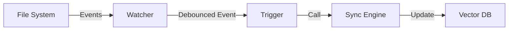

# Smart Fork Daemon Specification

**Component**: Smart Fork Background Service  
**Parent Project**: Smart Fork  
**Status**: Draft  
**Version**: 1.0  

## 1. Overview

The Smart Fork Daemon (`smart-fork-daemon`) is a background service that monitors OpenCode session storage for changes and automatically triggers incremental indexing. This ensures the semantic search index is always up-to-date without requiring manual `smart-fork sync` commands.

## 2. Architecture

### 2.1 Component Diagram

### 2.2 Key Components

1.  **Watcher**: Uses `watchdog` library to monitor `~/.local/share/opencode/storage/`.
2.  **Debouncer**: Aggregates rapid file system events (bursts) into a single trigger. OpenCode writes multiple files (metadata, messages, parts) during session activity.
3.  **Sync Engine**: Reuses the existing `sync_sessions(force=False)` logic to perform incremental updates.
4.  **Process Manager**: Handles daemon lifecycle (start/stop/status) using PID files.

## 3. Implementation Phases

### Phase 1: Foreground Watcher (MVP)
*Goal: Verify file monitoring and sync triggering logic.*

-   **Command**: `smart-fork watch`
-   **Behavior**: Runs in foreground, logs to stdout.
-   **Logic**:
    -   Watch `storage/session` recursively.
    -   Filter for `*.json` modifications/creations.
    -   Debounce window: 5.0 seconds.
    -   On trigger: Log event, run incremental sync.

### Phase 2: Background Service
*Goal: Run continuously without blocking a terminal.*

-   **Command**: `smart-fork daemon [start|stop|status]`
-   **Process Management**:
    -   **Double-fork** (standard daemon pattern) or simplified `subprocess.Popen` for stability.
    -   **PID File**: `~/.local/share/opencode/smart-fork/daemon.pid`
    -   **Log File**: `~/.local/share/opencode/smart-fork/daemon.log`
-   **Status Check**: Verify process existence via PID.

### Phase 3: System Persistence (Optional)
*Goal: Survive reboots.*

-   **Command**: `smart-fork daemon enable`
-   **Mechanism**:
    -   **macOS**: `launchd` plist in `~/Library/LaunchAgents/`.
    -   **Linux**: `systemd` user unit.

## 4. Technical Specifications

### 4.1 Configuration
No new configuration file needed. Reuses `smart-fork/config.json`.

### 4.2 File System Monitoring
-   **Path**: `~/.local/share/opencode/storage/` (recursive)
-   **Library**: `watchdog` (Python)
-   **Event Types**: `FileModified`, `FileCreated`
-   **Pattern**: `*.json`

### 4.3 Concurrency Control
To prevent race conditions between the daemon and manual CLI execution:
-   **Locking**: The `sync_sessions` function must implement a file lock (e.g., `sync.lock`) to ensure only one indexing operation runs at a time.

## 5. Dependencies
-   `watchdog>=4.0.0`
